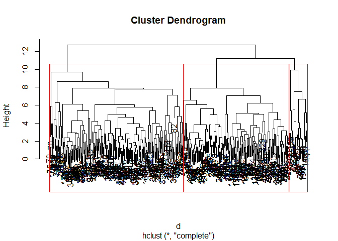
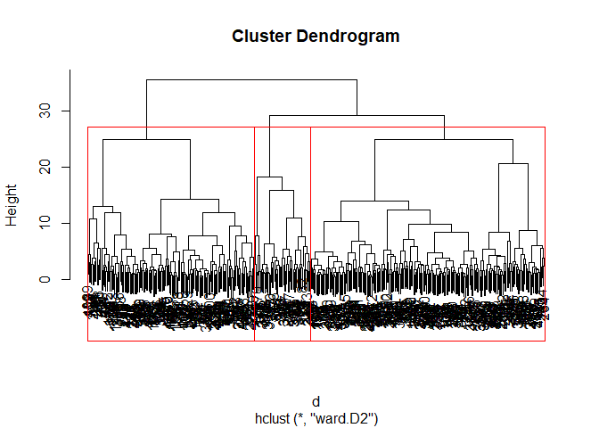

post2
================
Hwayoung Jung
December 2, 2018

``` r
dat=read.csv("TUTI_post2.csv",header=T)
#standardizing all variables except the categorical variable, "threat". All acoustic measurements are standardized.
sdat=scale(dat[,2:12])
# In this post, I will comparing whether clusters match with the 3 threats condition: low, medium, high,
# using hierarchical clustering (euclidean distance and complete linkage and euclidan distance with ward linkage), and K-means. Because the number of threat condition is 3, I will fix the number of clusters to be 3 in all methods to match the cluster labels and threat conditions later. 

# 1.Hierarchical clustering

#complete linkage with euclidean distance matrix
d = dist(sdat, method = "euclidean") # distance matrix
fit_comp = hclust(d, method="complete")
fit_ward = hclust(d, method="ward.D2")
plot(fit_comp) # display dendogram
#how many number of clusters?
rect.hclust(fit_comp, k=3, border="red")
```



``` r
hc_comp_labels= cutree(fit_comp, k=3)
hc_ward_labels= cutree(fit_ward, k=3)
plot(fit_ward) 
rect.hclust(fit_ward, k=3, border="red")
```



``` r
#2. K-means clustering
fit_km = kmeans(sdat, 3)
km_labels=fit_km$cluster
#plotcluster(sdat,km_labels)
```

So far, we performed 2 hierarchical clustering and K-means analysis. With the clusters obtained in the previous section, we will going to match with actual dependent variable, threat levels to see how accurately the clusters are divided, by using confusion matrix.

``` r
table(hc_comp_labels,dat[,1])
```

    ##               
    ## hc_comp_labels high low medium
    ##              1   16 100     54
    ##              2   17 166     32
    ##              3    6  12     12

``` r
table(hc_ward_labels,dat[,1])
```

    ##               
    ## hc_ward_labels high low medium
    ##              1    0 210      3
    ##              2    0  49      2
    ##              3   39  19     93

``` r
#k-means label here. see if I can find PC=>HW5 200line
```
