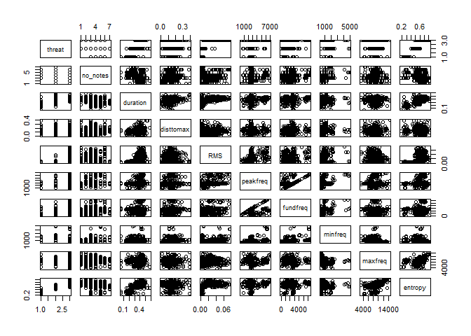
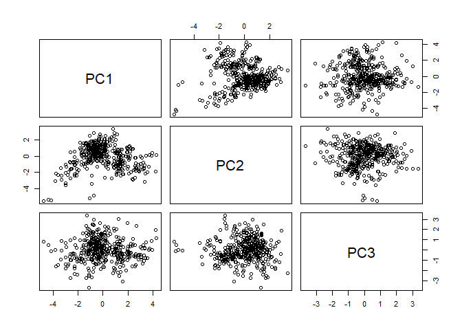
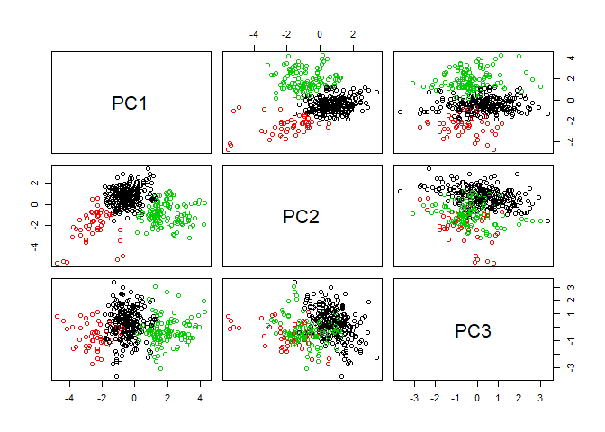
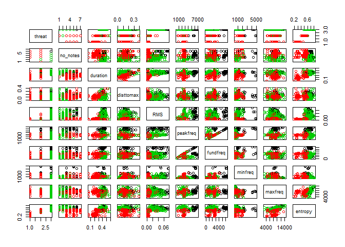
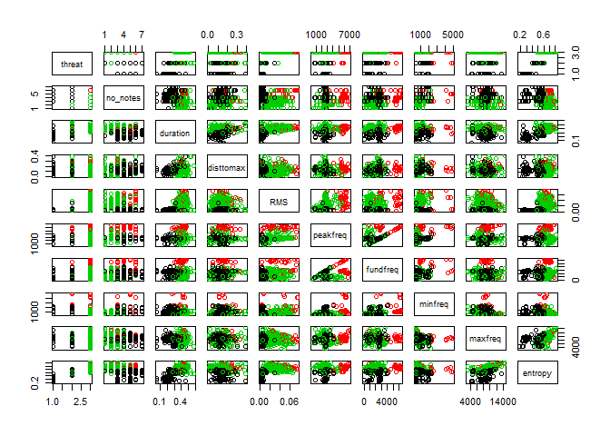
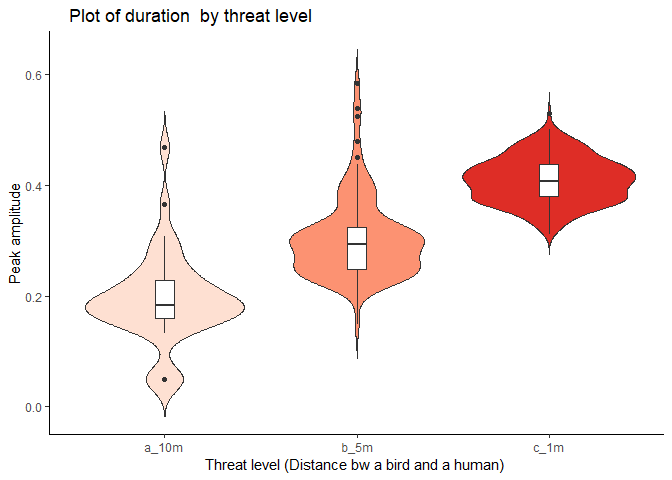

post2
================
Hwayoung Jung
December 2, 2018

Within-note variation in Tufted titmice (*baeolophus bicolor*)

1.  Purpose

The purpose of this post is to show how to examine presence of hidden subgroup and the subgroups match with a specific group category that is already known. I am studying the vocal behavior of Tufted titmice, commonly found species in Tennessee. The titmice produce various types of calls that convey threat information to other birds to alert them. There are 10 acoustic measurements of the titmice calls and 1 threat context. The goal of the analyses is to examine weather within-note property of D notes are associated with threat level.

The variables in the dataset are:

-   Threat: Ordinal level of predation threat with three levels: low (10m from a human observer), medium (5m from a human observer) and high (1m from a human observer). This will be regarded as a categorical variable.

-   No\_notes: The total number of calls produced

-   Duration: The temporal duration of calls measured in millisecond

-   Distomax: This is temporal duration to measure the time taken to reach the maximum amplitude from begging of the call.

-   RMS: Loudness of the call (dB)

-   Peakfreq: Peak frequency (high or low tone) of a call (kHz)

-   Fundfreq: fundamental frequency (kHz)

-   Minfreq: minimum frequency in (kHz)

-   Maxfreq: Maximum frequency in (kHz)

-   Entropy: The level of tonality (clear and pure tone like flute sound, or harsh sound such as cat's hissing call)

Among the 11 variables, threat will be used as dependent variables and all other variables will be dependent variables.

1.  Overview of analysis techniques

2.1 Hierarchical clustering

Hierarchical clustering is a technique by which group similar data points together by using hierarchical tree model, a dendrogram. 

Dendrogram is a figure that shows how each data point is grouped. Bottom of the plot shows all data points called leaves. They are grouped by clades (branch), and the leaves that are combined in the same height of branch are in the same cluster. Height of the branch indicates more dissimilarity between clusters.

There are largely 2 ways of merging groups: agglomerative and divisive.

Agglomerative is basically a bottom-up approach. It starts merging leaves into a bigger cluster based on similarity, until all nodes and leaves are merged into one root.

Divisive clustering is a top-down approach. It starts dividing one root into nodes and leaves based on dissimilarity until all nodes get separated into leaves.

There are 3 ways of measuring distance between clusters.

-   Single linkage: Calculate all pairwise distance and identify the closest distance between 2 clusters. Fast in calculation and works well for data of which order is important. Also good for separating few isolated groups.

-   Complete linkage Calculate all pairwise distance and identify the farthest distance between groups to maximize dissimilarity between clusters.

-   Average linkage calculate all pairwise distance with average distance between 2 clusters

Distances between data points are usually calculated with Euclidean distance, but there are many other options such as manhattan, bray-curtis.. etc.

2.2 PCA (Principal Component Analysis)

PCA is a technique to reduce dimension by calculating principal components that effectively represent variability with smaller numbers of variables. Normal regression analyses just use the variables themselves, but PCA creates new variables (PCs), each of which consists of original variables by differing intensity and direction.

Suppose there are P variables X1, X2,.., Xp and you want to make scatter plots for every pair of variables. The number of cases of choosing 2 variables out of P is P(p-1)/2, which seems to be too many. PCA is based on an idea that not all variables contribute for explaining variation of dependent variable. It aims to find out the most important variables. What does the PC look like?

Let's take an example of PC1, the PC that explains the largest variance.

PC1= 

Before running PCA, all variables should be centered or scaled because PCA focuses on variance. Since I am not going to use PCA as a separate method in this posting, and just calculate PCs that are going to be used in K-means clustering, I am not going to show how to interpret results.

2.3 K-means clustering

K-means clustering aims to divide observations into K clusters that do not overlap to find out data points that have similar traits while minimizing variance of distance among clusters. In other words, it partisions in the way that increase inner similarity of observations in the same cluster. It requires data to take Euclidean distance.

Let's look at how K-means cluster works. Step1: Decide the number of K. we can choose any natural number from 1. K Centroids (the mean center of cluster) will be randomly assigned first, so all centroids will almost overlap.

Step2: a. In the next step, nearest data points from each centroid will be assigned (labeled) as a cluster that belongs to a cluster.

1.  Then, centroid will be calculated again and moved to the point, where is the mean of the cluster. As procedure a and b are iterated repeatedly, the centroids will become more stable and eventually stay in the same place.

<!-- -->

1.  Pros and cons

Advantage of hierarchical clustering

-   It does not require to fix the number of the cluster from the beginning, unlike K-means clustering.

-   If same linkage, distance, and the number of clusters are used, you will get the same results.

Disadvantage of hiearchical clustering:

-   It subjects to be changed when using different linkage, distance and the number of clusters, so interpretation even on the same dataset may be vary.

Advantage of K-means:

-   Implementation is easy even for complicated or large dataset

-   Interpreation is easy because of internal integrity of clusters

-   It can be flexibly combined with PC axis calculated from PCA analysis. This is especially useful when the number of variables are large like the dataset I am going to show below.

Disadvantage of K-means:

-   K-means randomly assign centroid and may results in different results and lack consistency.

-   It requires prior knowledge of number of K. (But it does not matter in the data I am going to use. You will see below that I am going to use K=3, according to the number of threat levels)

1.  Analsysis 4.1 hierarchical clustering 4.1.2 hierarchical clustering with euclidean distance and complete linkage

This is the data to be analyzed in this post.

``` r
dat=read.csv("TUTI_post2_1210.csv",header=T)
head(dat)
```

    ##   threat no_notes duration disttomax    RMS peakfreq fundfreq minfreq
    ## 1    10m        3   0.1313    0.0754 0.0047     2555     2555     947
    ## 2    10m        3   0.1676    0.1088 0.0039     2610     2610     947
    ## 3    10m        3   0.3657    0.2242 0.0028     2576     2761    1205
    ## 4    10m        3   0.0490    0.1182 0.0046     2487     2487     947
    ## 5    10m        3   0.4680    0.3853 0.0026     2564     2543    1205
    ## 6    10m        3   0.2779    0.2053 0.0025     2539     2539     947
    ##   maxfreq entropy
    ## 1    9043   0.316
    ## 2    9043   0.343
    ## 3    4306   0.240
    ## 4    4306   0.174
    ## 5    4478   0.235
    ## 6    4478   0.222

``` r
plot(dat)
```

 Before running hierarchicla clustering, we need to standardize all variables except the categorical variable, "threat". All acoustic measurements are standardized.

``` r
sdat=scale(dat[,2:10])
#dat[,1] is the dependent variable, that is categorical with 3 threat levels: 10m from human (lowest level of threat, 5m from human-intermediate level of threat, 1m from human-highest level of threat)
```

The order of dat\[,1\] is set as 10m,1m and 5m. Let's re-order for easier interpretation.

``` r
print(levels(dat[,1]))
```

    ## [1] "10m" "1m"  "5m"

``` r
dat[,1]=factor(dat[,1],levels(dat[,1])[c(1,3,2)])
print(levels(dat[,1])) 
```

    ## [1] "10m" "5m"  "1m"

Now it is ordered as 10m, 5m and 1m. (From less threat to highest threat level.)

In this post, I will comparing whether clusters match with the 3 threats condition: low (10m), medium (5m) and high (1m), using hierarchical clustering (euclidean distance and complete linkage and euclidan distance with single linkage), and K-means.

Because the number of threat condition is 3, I will fix the number of clusters to be 3 in all methods to match the cluster labels and threat conditions later.

``` r
d = dist(sdat, method = "euclidean") # distance matrix
```

This is the distance matrix calculated with euclidean distance.

Now, let's first try fit hierarchical model with complete linkage.

``` r
fit_comp = hclust(d, method="complete")
hc_comp_labels= cutree(fit_comp, k=3)
plot(fit_comp) # display dendogram
rect.hclust(fit_comp, k=3, border="red")
```


4.1.3 hierarchical clustering with euclidean distance and single linkage

``` r
fit_sing = hclust(d, method="single")
hc_sing_labels= cutree(fit_sing, k=3)
plot(fit_sing)
```

 It does not seem like an appropriate method to classify 3 threat levels by looking at the dendrogram.

Now, let's try K-means with principal component axis.

4.2.1 Kmeans with Principal component axis

By using prcomp() function, we can extract PC1, PC2 and PC3.

``` r
pcs=prcomp(sdat,scale=F)
pcs1to3=data.frame(pcs$x[,1:3])#extract PC1 to PC3
plot(pcs1to3)
```

 This is pairwise plot of PC axis. In the next step, I will run K-means with the PC axis extracted above

``` r
fit_km_pc=kmeans(pcs1to3,3)
km_pc_labels=fit_km_pc$cluster
plot(pcs1to3,col=fit_km_pc$cluster)
```

 It seems clusters in PC1 and PC2 show good separation.

Next, let's see K-means fitted on the raw data, instead of PC axis. Of course, raw data has more variables than PC axis, so the pairwise plot should include much more plots.

4.2.2 K-means with Raw data

``` r
fit_km_r=kmeans(sdat,3)
km_r_labels=fit_km_r$cluster
plot(dat,col=fit_km_r$cluster)
```



Overall, it does not show clear clustering showed above in the K-means with PC axis. Also, the 1m(green) and 5m (red) tended to be separated, while 10m (black) was mixed into other clusters. Duration, RMS and entropy seemed to separates clusters better than other variables. Will this turns out to be true? We will look prediction accuracy using confusion matrix shown below.

4.3 Prediction accuracy of 4 methods above

So far, we performed 2 hierarchical clustering and K-means analysis combined with PCA and applied on raw data. With the clusters obtained in the previous section, we will going to match with actual dependent variable, threat levels to see how accurately the clusters are divided, by using confusion matrix.

``` r
table(hc_comp_labels,dat[,1])#confusion matrix of hierarchical clustering with complete linkage
```

    ##               
    ## hc_comp_labels 10m  5m  1m
    ##              1  39  59  80
    ##              2   0   1  84
    ##              3   0  38 114

``` r
table(hc_sing_labels,dat[,1])#confusion matrix of hierarchical clustering with complete linkage
```

    ##               
    ## hc_sing_labels 10m  5m  1m
    ##              1  39  96 274
    ##              2   0   0   3
    ##              3   0   2   1

``` r
table(km_pc_labels,dat[,1])#confusion matrix of K-means with PC 
```

    ##             
    ## km_pc_labels 10m  5m  1m
    ##            1  39  86   1
    ##            2   0   7 233
    ##            3   0   5  44

``` r
table(km_r_labels,dat[,1])#confusion matrix of K-means analysis on raw data
```

    ##            
    ## km_r_labels 10m  5m  1m
    ##           1  39  90   1
    ##           2   0   4  41
    ##           3   0   4 236

It seems that k-means with raw data showed the most high accuracy. Particularly, it predicted 1m (high threat) pretty well. Hierarchical clustering with complete linkage showed less high accuracy, but hiearchical clustering with single linkage and K-means with PC axis showed the least accurate results.

\`\`\` It seems that two variables, duration and RMS are associated with threat level. Let's see how they differ across 3 threat levels.

``` r
#violin plot
library("ggplot2")
```

    ## Warning: package 'ggplot2' was built under R version 3.4.4

``` r
#duration: violin plot overlaid with boxplot
ggplot(dat,aes(x=dat$threat,y=dat[,3],fill=dat$threat))+
  geom_violin(trim=F)+
  geom_boxplot(width=0.1,fill="white")+
  theme_classic()+
  scale_fill_brewer(palette="Reds")+
  labs(title="    Plot of duration  by threat level",x="Threat level (Distance bw a bird and a human) ", y = "Peak amplitude")+
  theme(legend.position="none")
```



``` r
#RMS: violin plot overlaid with boxplot
ggplot(dat,aes(x=dat$threat,y=dat[,5],fill=dat$threat))+
  geom_violin(trim=F)+
  geom_boxplot(width=0.03,fill="white")+
  theme_classic()+
  scale_fill_brewer(palette="Reds")+
  labs(title="    Plot of RMS  by threat level",x="Threat level (Distance bw a bird and a human) ", y = "RMS")+
  theme(legend.position="none")
```

 Both Duration and RMS tended to increase as threat level increased.

conclusions: As the birds are in the highest level of threat, they tended to produce calls with louder decibels and longer duration. Among 4 kinds of cluster models, K-means applied on the raw data showed the highest prediction accuracy.
