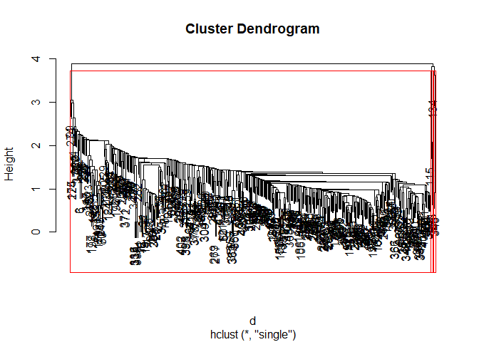
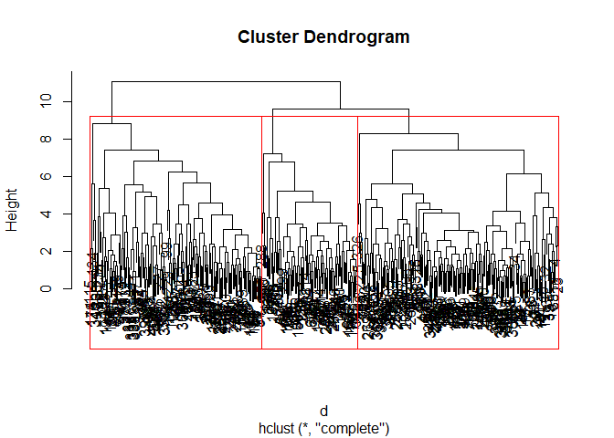

post2
================
Hwayoung Jung
December 2, 2018

Within-note variation in Tufted titmice (*baeolophus bicolor*) Purpose: To examine weather within-note property of D notes are associated with threat level

``` r
dat=read.csv("TUTI_post2_1.csv",header=T)
plot(dat)
```


``` r
#standardizing all variables except the categorical variable, "threat". All acoustic measurements are standardized.
sdat=scale(dat[,2:12])
#dat[,1] is the dependent variable, that is categorical with 3 threat levels: 10m from human (lowest level of threat, 5m from human-intermediate level of threat, 1m from human-highest level of threat)
print(levels(dat[,1]))
```

    ## [1] "10m" "1m"  "5m"

``` r
#the order of dat[,1] is set as 10m,1m and 5m.
#Let's re-order for easier interpretation, according to threat level.

dat[,1]=factor(dat[,1], levels(dat[,1])[c(1,3,2)])
print(levels(dat[,1])) #Now it is ordered as 10m, 5m and 1m. From less threat to highest threat level.
```

    ## [1] "10m" "5m"  "1m"

``` r
# In this post, I will comparing whether clusters match with the 3 threats condition: low, medium, high,
# using hierarchical clustering (euclidean distance and complete linkage and euclidan distance with ward linkage), and K-means. Because the number of threat condition is 3, I will fix the number of clusters to be 3 in all methods to match the cluster labels and threat conditions later. 
```

1.Hierarchical clustering
=========================

complete linkage with euclidean distance matrix
===============================================

``` r
d = dist(sdat, method = "euclidean") # distance matrix
fit_comp = hclust(d, method="complete")
fit_ward = hclust(d, method="ward.D2")
plot(fit_comp) # display dendogram
#how many number of clusters?
rect.hclust(fit_comp, k=3, border="red")
```


``` r
hc_comp_labels= cutree(fit_comp, k=3)
hc_ward_labels= cutree(fit_ward, k=3)
plot(fit_ward) 
rect.hclust(fit_ward, k=3, border="red")
```

 \#PCA

``` r
pcs=princomp(sdat,scale=F)#since we already standardized data, x need to do one more time.
```

    ## Warning: In princomp.default(sdat, scale = F) :
    ##  extra argument 'scale' will be disregarded

``` r
plot(pcs,type='l')
```



``` r
summary(pcs)
```

    ## Importance of components:
    ##                         Comp.1    Comp.2    Comp.3    Comp.4     Comp.5
    ## Standard deviation     1.56635 1.4786114 1.3454932 1.2305241 0.97617699
    ## Proportion of Variance 0.22358 0.1992339 0.1649750 0.1379861 0.08683848
    ## Cumulative Proportion  0.22358 0.4228139 0.5877888 0.7257749 0.81261341
    ##                            Comp.6     Comp.7    Comp.8     Comp.9
    ## Standard deviation     0.84148094 0.74923826 0.6653343 0.48364595
    ## Proportion of Variance 0.06452732 0.05115581 0.0403399 0.02131622
    ## Cumulative Proportion  0.87714073 0.92829654 0.9686364 0.98995266
    ##                            Comp.10     Comp.11
    ## Standard deviation     0.292171916 0.157765593
    ## Proportion of Variance 0.007779148 0.002268191
    ## Cumulative Proportion  0.997731809 1.000000000

``` r
pcs=prcomp(sdat,scale=F)
pcs1to3=data.frame(pcs$x[,1:3])#extract PC1 to PC3
plot(pcs1to3)
```

 \#2. K-means clustering combined with PCA axis

``` r
k=kmeans(pcs1to3,3)
plot(pcs1to3,col=k$cluster)
```

 2.1 what happens if we don't use pc axis and just use axis of raw data?

``` r
#what happens if we don't use pc axis and just use axis of raw data?
k=kmeans(sdat,3)
plot(dat,col=k$cluster)
```


``` r
fit_km = kmeans(sdat, 3)
km_labels=fit_km$cluster
```

It seems that one variable, "peakamp" is somewhat positively associated with threat level. "RMS" seems also positively correlated with threat level, but less obvious than "peakamp"

``` r
#violin plot
library("ggplot2")
```

    ## Warning: package 'ggplot2' was built under R version 3.4.4

``` r
#Peak amplitude: violin plot overlaid with boxplot
ggplot(dat,aes(x=dat$threat,y=dat[,8],fill=dat$threat))+
  geom_violin(trim=F)+
  geom_boxplot(width=0.1,fill="white")+
  theme_classic()+
  scale_fill_brewer(palette="Reds")+
  labs(title="    Plot of Peak amplitude  by threat level",x="Threat level (Distance bw a bird and a human) ", y = "Peak amplitude")+
  theme(legend.position="none")
```


``` r
#RMS: violin plot overlaid with boxplot
ggplot(dat,aes(x=dat$threat,y=dat[,5],fill=dat$threat))+
  geom_violin(trim=F)+
  geom_boxplot(width=0.03,fill="white")+
  theme_classic()+
  scale_fill_brewer(palette="Reds")+
  labs(title="    Plot of RMS  by threat level",x="Threat level (Distance bw a bird and a human) ", y = "RMS")+
  theme(legend.position="none")
```


``` r
#as the threat level increases, they increased peak amplitude.
```

So far, we performed 2 hierarchical clustering and K-means analysis combined with PCA. With the clusters obtained in the previous section, we will going to match with actual dependent variable, threat levels to see how accurately the clusters are divided, by using confusion matrix.

``` r
table(hc_comp_labels,dat[,1])#confusion matrix of hierarchical clustering with complete linkage
```

    ##               
    ## hc_comp_labels 10m  5m  1m
    ##              1  16  54 100
    ##              2  17  32 166
    ##              3   6  12  12

``` r
table(hc_ward_labels,dat[,1])#confusion matrix of hierarchical clustering with complete linkage
```

    ##               
    ## hc_ward_labels 10m  5m  1m
    ##              1   0   3 210
    ##              2   0   2  49
    ##              3  39  93  19

``` r
table(km_labels,dat[,1])#confusion matrix of K-means analysis combined with PCA
```

    ##          
    ## km_labels 10m  5m  1m
    ##         1  39  93  31
    ##         2   0   4  72
    ##         3   0   1 175

(Tentative)conclusions: Because the low prediction accuracy shown in those confusion matrices, most of variables do not seem to contribute to explain variation in the threat level. However, at least peak amplitude (and possibly RMS) changes accross threat level.
