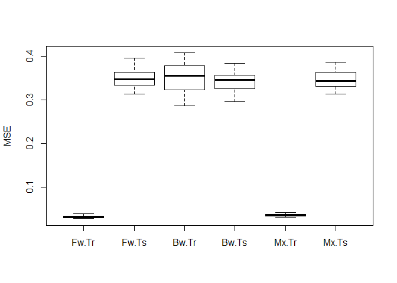

post3
================
Hwayoung Jung
December 2, 2018

1. Purpose
==========

In this post, I will show how to build a model with variable selection methods using stepwise selection. I will generate models to predict important factors associated with house price. Variables are shown below:

-   id: an identical number labeled for each house

-   date: Date of the house was sold

-   price: The house price (Dependent variable)

-   bedrooms: The number of bedroons in the house

-   bathrooms: The number of bathrooms divided by the number of bedrooms

-   sqft\_living: area of the house in square ft.

-   sqft\_lot: area of the house lot in square ft.

-   floors: The number of total floors in the house.

-   waterfront: Whether the house is built near waterfront for view

-   view: Whether or not it has been viewed by other people

-   condition: Overall condition of the house

-   grade: overall grade of the house using "King County grading system"

-   sqft\_above: Area of the house from basement in square ft.

-   sqft\_basement: Area of the basement in square ft.

-   yr\_built: Years of the house was built

-   yr\_renovated: Year of the house renovation

-   zipcode: zipcode of the address of the house

-   lat: Latitude of the house

-   long: longitude of the house

-   sqft\_living15: Area of livingroom in 2015

-   sqft\_lot15: Area of lot in 2015

The dataset is obtained from kaggle. (<https://www.kaggle.com/harlfoxem/housesalesprediction>).

2. Overview of analysis techniques
----------------------------------

2.1 Model selection criteria
============================


This is a typical multiple regression form, whre X1~Xp are variables and Beta1~Betap are coefficients of each variable, beta0 is an intercept, e is an error term. It might be tempting to include as many variables as possible to consider many factors that would explain the dependent variable. Indeed, R^2 will increase as you include more variables in a model. But will all the variables actually contribute in predicting the dependent variable? The problem of R^2 is that it blindly increases regardless actual contribution of variables. That means, even if you include any irrelevant variable, R^2 still increases. There are several model selection criteria to handle this issue: AIC, BIC, Cp and adjusted R^2. Among these, AIC is most frequently used.


Both AIC and BIC have the similar structure- combining measurement of prediction accuracy and penalty for increasing complexity of the model, which increases as the number of variable increases. n is the number of variable and m represents the sample size. Unlike AIC that just subtract n from the prediction accuracy measuremnt, BIC considers both the number of variables and the sample size, usually resulting in higher penatly for including more variables. The smaller the criteria, the better.

Using the model selection criteria shown above, we can conduct stepwise model selection. There are mainly 3 ways: forward, backward and mixed selection. The method is called 'stepwise' because it adds/removes a single variable at a time.

2.2 Forward stepwise model
==========================

-   Forward stepwise model starts fitting a null model that does not include any variables first, then add one variable at a time until all variables are included.

2.3 Backward stepwise model
===========================

-   Backward stepwisse model starts from a full model that includes all variables, then remove one least significantly contributing variable at a time until all variables are included.

2.4 Mixed stepwise model
========================

-   Mixed selection is a combination of forward and backward selection. The constraints of forward and backward selection is that, once variables are included, the change cannot be reversed. For example, in backward selection, if a variable is removed, then the removed variable cannot be included in the model later. In forward selection, if a variable is added, it cannot be removed. But the bidirectional selection flexibly remove a variable that was previously added and add a variable that was previously removed if the previous change does not improve the fitness of the model which is checked by model criteria value (AIC, BIC ..etc).

3. Pros cons of the model
-------------------------

Advantages: - Computationally efficient and fast - Easy to interprete with smaller number of variables included in the final model

Disadvantages: - P-values do not provide meaningful information because of the bias - Not efficient in dealing with variables with high collinearity. It will just randomly remove one variable among highly correlated variables.

Even though I excluded some variables, there are still 13 variables so it needs to go further selection process to make more simpler, accurate model. In the following analysis, I will use forward, backward and bidirectinoal selection model with different model selection criteria.

4. Data analysis
----------------

4.1 Pre-processing
==================

``` r
dat=read.csv("kc_house_data.csv")
dim(dat)
```

    ## [1] 21613    21

The original dataset includes 21613 rows and 21 columns. To make the prediction more meaningful, I have selected some rows and columns to include for data analysis. For rows, I only chose rows of which the zipcode is 98006. This dataset only contains variables about features of house itself (such as \#of room, area of specific place in the house etc..). Since house price is also subject to change according to external traits such as population of a city and development of public transportation and so on. For example, house price cannot be compared between san francisco in CA and Knoxville in TN. Hence, to remove the effect of location, I randomly selected just one zipcode, 98006.

``` r
dat = subset(dat, zipcode=="98006")
head(dat)
```

    ##             id            date   price bedrooms bathrooms sqft_living
    ## 142 1777500060 20140708T000000  527700        5      2.50        2820
    ## 145 6071600370 20150227T000000  500000        4      2.25        2030
    ## 154 7855801670 20150401T000000 2250000        4      3.25        5180
    ## 168 1836980160 20150324T000000  807100        4      2.50        2680
    ## 175 1687900520 20140929T000000  673000        4      2.25        2590
    ## 289 9552700140 20140702T000000  675000        5      2.25        2900
    ##     sqft_lot floors waterfront view condition grade sqft_above
    ## 142     9375      1          0    0         4     8       1550
    ## 145     8517      1          0    0         4     8       1380
    ## 154    19850      2          0    3         3    12       3540
    ## 168     4499      2          0    0         3     9       2680
    ## 175     8190      2          0    0         4     8       2590
    ## 289    10300      1          0    0         3     8       1450
    ##     sqft_basement yr_built yr_renovated zipcode     lat     long
    ## 142          1270     1968            0   98006 47.5707 -122.128
    ## 145           650     1961            0   98006 47.5495 -122.174
    ## 154          1640     2006            0   98006 47.5620 -122.162
    ## 168             0     1999            0   98006 47.5650 -122.125
    ## 175             0     1980            0   98006 47.5619 -122.125
    ## 289          1450     1985            0   98006 47.5461 -122.151
    ##     sqft_living15 sqft_lot15
    ## 142          2820       9375
    ## 145          2230       8824
    ## 154          3160       9750
    ## 168          2920       4500
    ## 175          2260       8335
    ## 289          2310      10300

For columns, I excluded unnecessary, irrelevant variables with house price, such as id, date, zipcode, latitude and longitude. Also excluded the yr\_renovated because it contained too many 0s and didn't seem to be meaningful to include it.

``` r
#excluding unnecessary, irrelevant variables with house price
dat=dat[,-c(1,2,16,17,18,19)]
```

I will covert variable waterfront, view and condition because they are categorical variables. For remaining independent variables, I will standardize those because they are in different units.

``` r
#converting data type as factor for categorical variables
dat=transform(dat, waterfront=as.factor(waterfront))
dat=transform(dat, view=as.factor(view))
dat=transform(dat, condition=as.factor(condition))
```

The scale of price is quite large. The minimum is 75000 and the maximum is 7700000. I will log-transform the dependent variable, rather than scaling it. For log-transformation, generally We need to be cautious because it would not work for the values equal to 0. In this case, we add 1 as a convention. log(dat+1).

But in this data, the price is all above 0, so I just used log(dat)

``` r
sdat=as.data.frame(cbind(log(dat[,1]),scale(dat[,-c(1,7,8,9)],center=T,scale=T),dat[,c(7,8,9)]))#standardizing excluding categorical variable and dependent variable
#renaming the first column
colnames(sdat)[1] = "price"
```

Then I will split the data into half training and half test data.

``` r
#splitting into training and test data
x=sdat[,2:15]
y=sdat[,1]
train = sample(1:nrow(x), nrow(x)/2)
test = (-train)
```

4.2 Forward selection model
===========================

Now we are ready to run forward, backward and mixed stepwise selection models. Let's get started with forward selection model.

``` r
#1. forward selection
library(MASS)
fit = lm(price~., data=sdat[train,])
#explain stepAIC function.
#Model selection criteria
```

Using stepAIC function automatically adds variables step by step. To see the results, use object\_name\_of\_model$anova

``` r
fit_fw = stepAIC(fit, direction="forward") # stepwise selection
```

    ## Start:  AIC=-782.47
    ## price ~ bedrooms + bathrooms + sqft_living + sqft_lot + floors + 
    ##     grade + sqft_above + sqft_basement + yr_built + sqft_living15 + 
    ##     sqft_lot15 + waterfront + view + condition

``` r
#results
fit_fw$anova
```

    ## Stepwise Model Path 
    ## Analysis of Deviance Table
    ## 
    ## Initial Model:
    ## price ~ bedrooms + bathrooms + sqft_living + sqft_lot + floors + 
    ##     grade + sqft_above + sqft_basement + yr_built + sqft_living15 + 
    ##     sqft_lot15 + waterfront + view + condition
    ## 
    ## Final Model:
    ## price ~ bedrooms + bathrooms + sqft_living + sqft_lot + floors + 
    ##     grade + sqft_above + sqft_basement + yr_built + sqft_living15 + 
    ##     sqft_lot15 + waterfront + view + condition
    ## 
    ## 
    ##   Step Df Deviance Resid. Df Resid. Dev     AIC
    ## 1                        230   9.229387 -782.47

This shows the final model of forward selection, but here is a problem. The final model contains all variables in the initial model and no variables were selected at all.

4.3 Backward selection model
============================

Then, what about backward selection method? Let's try.

``` r
fit_bw = stepAIC(fit, direction="backward") # stepwise selection
```

    ## Start:  AIC=-782.47
    ## price ~ bedrooms + bathrooms + sqft_living + sqft_lot + floors + 
    ##     grade + sqft_above + sqft_basement + yr_built + sqft_living15 + 
    ##     sqft_lot15 + waterfront + view + condition
    ## 
    ## 
    ## Step:  AIC=-782.47
    ## price ~ bedrooms + bathrooms + sqft_living + sqft_lot + floors + 
    ##     grade + sqft_above + yr_built + sqft_living15 + sqft_lot15 + 
    ##     waterfront + view + condition
    ## 
    ##                 Df Sum of Sq     RSS     AIC
    ## - yr_built       1   0.00092  9.2303 -784.45
    ## - sqft_lot       1   0.02407  9.2535 -783.82
    ## - bedrooms       1   0.03132  9.2607 -783.63
    ## - sqft_lot15     1   0.04314  9.2725 -783.31
    ## <none>                        9.2294 -782.47
    ## - floors         1   0.07982  9.3092 -782.33
    ## - bathrooms      1   0.08416  9.3135 -782.21
    ## - condition      3   0.28907  9.5185 -780.79
    ## - waterfront     1   0.14289  9.3723 -780.64
    ## - sqft_living15  1   0.14825  9.3776 -780.50
    ## - sqft_above     1   0.22656  9.4560 -778.43
    ## - sqft_living    1   0.35918  9.5886 -774.96
    ## - view           4   0.85167 10.0811 -768.49
    ## - grade          1   0.89087 10.1203 -761.53
    ## 
    ## Step:  AIC=-784.45
    ## price ~ bedrooms + bathrooms + sqft_living + sqft_lot + floors + 
    ##     grade + sqft_above + sqft_living15 + sqft_lot15 + waterfront + 
    ##     view + condition
    ## 
    ##                 Df Sum of Sq     RSS     AIC
    ## - sqft_lot       1   0.02403  9.2543 -785.80
    ## - bedrooms       1   0.03457  9.2649 -785.51
    ## - sqft_lot15     1   0.04266  9.2730 -785.30
    ## <none>                        9.2303 -784.45
    ## - floors         1   0.08904  9.3193 -784.05
    ## - bathrooms      1   0.09633  9.3266 -783.86
    ## - condition      3   0.29320  9.5235 -782.66
    ## - waterfront     1   0.15355  9.3839 -782.34
    ## - sqft_living15  1   0.18057  9.4109 -781.62
    ## - sqft_above     1   0.22725  9.4576 -780.39
    ## - sqft_living    1   0.36293  9.5932 -776.84
    ## - view           4   0.88902 10.1193 -769.55
    ## - grade          1   0.92990 10.1602 -762.54
    ## 
    ## Step:  AIC=-785.8
    ## price ~ bedrooms + bathrooms + sqft_living + floors + grade + 
    ##     sqft_above + sqft_living15 + sqft_lot15 + waterfront + view + 
    ##     condition
    ## 
    ##                 Df Sum of Sq     RSS     AIC
    ## - sqft_lot15     1   0.02062  9.2750 -787.24
    ## - bedrooms       1   0.03490  9.2892 -786.86
    ## <none>                        9.2543 -785.80
    ## - floors         1   0.07874  9.3331 -785.69
    ## - bathrooms      1   0.10196  9.3563 -785.07
    ## - waterfront     1   0.14986  9.4042 -783.80
    ## - condition      3   0.30624  9.5606 -783.69
    ## - sqft_living15  1   0.20757  9.4619 -782.27
    ## - sqft_above     1   0.22660  9.4809 -781.77
    ## - sqft_living    1   0.34178  9.5961 -778.77
    ## - view           4   0.92493 10.1793 -770.08
    ## - grade          1   0.90905 10.1634 -764.47
    ## 
    ## Step:  AIC=-787.24
    ## price ~ bedrooms + bathrooms + sqft_living + floors + grade + 
    ##     sqft_above + sqft_living15 + waterfront + view + condition
    ## 
    ##                 Df Sum of Sq     RSS     AIC
    ## - bedrooms       1   0.04143  9.3164 -788.13
    ## <none>                        9.2750 -787.24
    ## - floors         1   0.09256  9.3675 -786.77
    ## - bathrooms      1   0.10400  9.3790 -786.47
    ## - waterfront     1   0.15204  9.4270 -785.20
    ## - condition      3   0.31947  9.5944 -784.81
    ## - sqft_living15  1   0.23619  9.5111 -782.98
    ## - sqft_above     1   0.24609  9.5210 -782.72
    ## - sqft_living    1   0.34765  9.6226 -780.08
    ## - view           4   0.90432 10.1793 -772.08
    ## - grade          1   0.93921 10.2142 -765.23
    ## 
    ## Step:  AIC=-788.13
    ## price ~ bathrooms + sqft_living + floors + grade + sqft_above + 
    ##     sqft_living15 + waterfront + view + condition
    ## 
    ##                 Df Sum of Sq     RSS     AIC
    ## <none>                        9.3164 -788.13
    ## - bathrooms      1   0.08382  9.4002 -787.90
    ## - floors         1   0.09078  9.4072 -787.72
    ## - waterfront     1   0.15726  9.4737 -785.97
    ## - condition      3   0.32459  9.6410 -785.61
    ## - sqft_living15  1   0.22352  9.5399 -784.23
    ## - sqft_above     1   0.25503  9.5714 -783.41
    ## - sqft_living    1   0.30820  9.6246 -782.03
    ## - view           4   0.95405 10.2704 -771.86
    ## - grade          1   1.07115 10.3875 -763.03

``` r
fit_bw$anova
```

    ## Stepwise Model Path 
    ## Analysis of Deviance Table
    ## 
    ## Initial Model:
    ## price ~ bedrooms + bathrooms + sqft_living + sqft_lot + floors + 
    ##     grade + sqft_above + sqft_basement + yr_built + sqft_living15 + 
    ##     sqft_lot15 + waterfront + view + condition
    ## 
    ## Final Model:
    ## price ~ bathrooms + sqft_living + floors + grade + sqft_above + 
    ##     sqft_living15 + waterfront + view + condition
    ## 
    ## 
    ##              Step Df     Deviance Resid. Df Resid. Dev       AIC
    ## 1                                       230   9.229387 -782.4700
    ## 2 - sqft_basement  0 0.0000000000       230   9.229387 -782.4700
    ## 3      - yr_built  1 0.0009204732       231   9.230307 -784.4452
    ## 4      - sqft_lot  1 0.0240257954       232   9.254333 -785.7979
    ## 5    - sqft_lot15  1 0.0206215877       233   9.274954 -787.2437
    ## 6      - bedrooms  1 0.0414338587       234   9.316388 -788.1338

Final models included fewer variables than in initial model. Let's proceed on with the final model

``` r
fit_bw_f=lm(price~sqft_living + sqft_lot + grade + sqft_above + sqft_living15 +sqft_lot15 + waterfront + view + condition,data=sdat[train,])
summary(fit_bw_f)
```

    ## 
    ## Call:
    ## lm(formula = price ~ sqft_living + sqft_lot + grade + sqft_above + 
    ##     sqft_living15 + sqft_lot15 + waterfront + view + condition, 
    ##     data = sdat[train, ])
    ## 
    ## Residuals:
    ##      Min       1Q   Median       3Q      Max 
    ## -0.53006 -0.11352 -0.01141  0.09919  0.85736 
    ## 
    ## Coefficients:
    ##               Estimate Std. Error t value Pr(>|t|)    
    ## (Intercept)   13.33772    0.20272  65.794  < 2e-16 ***
    ## sqft_living    0.13556    0.02847   4.761 3.38e-06 ***
    ## sqft_lot      -0.02482    0.03669  -0.676  0.49941    
    ## grade          0.15217    0.02881   5.282 2.92e-07 ***
    ## sqft_above     0.05668    0.02965   1.911  0.05717 .  
    ## sqft_living15  0.05392    0.02712   1.988  0.04794 *  
    ## sqft_lot15     0.03171    0.02897   1.095  0.27480    
    ## waterfront1    0.41094    0.21160   1.942  0.05333 .  
    ## view1          0.01060    0.12208   0.087  0.93086    
    ## view2          0.12409    0.04766   2.604  0.00981 ** 
    ## view3          0.04079    0.05815   0.702  0.48367    
    ## view4          0.30615    0.07048   4.344 2.09e-05 ***
    ## condition3     0.14658    0.20415   0.718  0.47347    
    ## condition4     0.20095    0.20275   0.991  0.32267    
    ## condition5     0.27608    0.20573   1.342  0.18092    
    ## ---
    ## Signif. codes:  0 '***' 0.001 '**' 0.01 '*' 0.05 '.' 0.1 ' ' 1
    ## 
    ## Residual standard error: 0.2006 on 234 degrees of freedom
    ## Multiple R-squared:  0.8001, Adjusted R-squared:  0.7882 
    ## F-statistic: 66.91 on 14 and 234 DF,  p-value: < 2.2e-16

Notice the Final reduced model of backward selection still contains so many variables.

4.4 Mixed selection model
=========================

Let's see if the variable selection option, "both" with BIC criteria produce more parsimonious final models with fewer variables. To select BIC as a model selection criteria, set k=log(the number of rows in data) in the stepAIC function. (By default, the k=2, which is meant for AIC criteria)

``` r
fit_fb = stepAIC(fit, direction="both",k = log(nrow(sdat[train,])))
```

    ## Start:  AIC=-715.64
    ## price ~ bedrooms + bathrooms + sqft_living + sqft_lot + floors + 
    ##     grade + sqft_above + sqft_basement + yr_built + sqft_living15 + 
    ##     sqft_lot15 + waterfront + view + condition
    ## 
    ## 
    ## Step:  AIC=-715.64
    ## price ~ bedrooms + bathrooms + sqft_living + sqft_lot + floors + 
    ##     grade + sqft_above + yr_built + sqft_living15 + sqft_lot15 + 
    ##     waterfront + view + condition
    ## 
    ##                 Df Sum of Sq     RSS     AIC
    ## - condition      3   0.28907  9.5185 -724.51
    ## - yr_built       1   0.00092  9.2303 -721.13
    ## - sqft_lot       1   0.02407  9.2535 -720.51
    ## - bedrooms       1   0.03132  9.2607 -720.31
    ## - sqft_lot15     1   0.04314  9.2725 -719.99
    ## - floors         1   0.07982  9.3092 -719.01
    ## - bathrooms      1   0.08416  9.3135 -718.90
    ## - waterfront     1   0.14289  9.3723 -717.33
    ## - sqft_living15  1   0.14825  9.3776 -717.19
    ## - view           4   0.85167 10.0811 -715.73
    ## <none>                        9.2294 -715.64
    ## - sqft_above     1   0.22656  9.4560 -715.12
    ## - sqft_living    1   0.35918  9.5886 -711.65
    ## - grade          1   0.89087 10.1203 -698.21
    ## 
    ## Step:  AIC=-724.51
    ## price ~ bedrooms + bathrooms + sqft_living + sqft_lot + floors + 
    ##     grade + sqft_above + yr_built + sqft_living15 + sqft_lot15 + 
    ##     waterfront + view
    ## 
    ##                 Df Sum of Sq     RSS     AIC
    ## - yr_built       1   0.00504  9.5235 -729.90
    ## - sqft_lot       1   0.03681  9.5553 -729.07
    ## - bedrooms       1   0.04060  9.5591 -728.97
    ## - sqft_lot15     1   0.05370  9.5722 -728.63
    ## - bathrooms      1   0.09495  9.6134 -727.56
    ## - floors         1   0.10889  9.6274 -727.20
    ## - waterfront     1   0.12451  9.6430 -726.79
    ## - sqft_living15  1   0.16301  9.6815 -725.80
    ## - sqft_above     1   0.18269  9.7012 -725.29
    ## <none>                        9.5185 -724.51
    ## - view           4   0.90077 10.4192 -724.07
    ## - sqft_living    1   0.43212  9.9506 -718.97
    ## + condition      3   0.28907  9.2294 -715.64
    ## - grade          1   0.86172 10.3802 -708.45
    ## 
    ## Step:  AIC=-729.9
    ## price ~ bedrooms + bathrooms + sqft_living + sqft_lot + floors + 
    ##     grade + sqft_above + sqft_living15 + sqft_lot15 + waterfront + 
    ##     view
    ## 
    ##                 Df Sum of Sq     RSS     AIC
    ## - bedrooms       1   0.03686  9.5604 -734.45
    ## - sqft_lot       1   0.03707  9.5606 -734.45
    ## - sqft_lot15     1   0.06714  9.5906 -733.67
    ## - bathrooms      1   0.09024  9.6137 -733.07
    ## - waterfront     1   0.16340  9.6869 -731.18
    ## - sqft_living15  1   0.16485  9.6884 -731.14
    ## - floors         1   0.16864  9.6921 -731.04
    ## - sqft_above     1   0.19434  9.7178 -730.38
    ## <none>                        9.5235 -729.90
    ## - view           4   1.00237 10.5259 -727.05
    ## + yr_built       1   0.00504  9.5185 -724.51
    ## - sqft_living    1   0.42930  9.9528 -724.44
    ## + condition      3   0.29320  9.2303 -721.13
    ## - grade          1   0.87294 10.3964 -713.58
    ## 
    ## Step:  AIC=-734.45
    ## price ~ bathrooms + sqft_living + sqft_lot + floors + grade + 
    ##     sqft_above + sqft_living15 + sqft_lot15 + waterfront + view
    ## 
    ##                 Df Sum of Sq     RSS     AIC
    ## - sqft_lot       1   0.03761  9.5980 -738.99
    ## - bathrooms      1   0.07213  9.6325 -738.10
    ## - sqft_lot15     1   0.07395  9.6343 -738.05
    ## - sqft_living15  1   0.15241  9.7128 -736.03
    ## - floors         1   0.16511  9.7255 -735.71
    ## - waterfront     1   0.16843  9.7288 -735.62
    ## - sqft_above     1   0.19950  9.7599 -734.83
    ## <none>                        9.5604 -734.45
    ## - view           4   1.05747 10.6178 -730.40
    ## - sqft_living    1   0.39271  9.9531 -729.95
    ## + bedrooms       1   0.03686  9.5235 -729.90
    ## + yr_built       1   0.00130  9.5591 -728.97
    ## + condition      3   0.29549  9.2649 -725.72
    ## - grade          1   0.98327 10.5436 -715.59
    ## 
    ## Step:  AIC=-738.99
    ## price ~ bathrooms + sqft_living + floors + grade + sqft_above + 
    ##     sqft_living15 + sqft_lot15 + waterfront + view
    ## 
    ##                 Df Sum of Sq     RSS     AIC
    ## - sqft_lot15     1   0.04301  9.6410 -743.40
    ## - bathrooms      1   0.07911  9.6771 -742.47
    ## - floors         1   0.14902  9.7470 -740.67
    ## - waterfront     1   0.16232  9.7603 -740.33
    ## - sqft_living15  1   0.18222  9.7802 -739.83
    ## - sqft_above     1   0.19864  9.7966 -739.41
    ## <none>                        9.5980 -738.99
    ## - sqft_living    1   0.36187  9.9598 -735.29
    ## + sqft_lot       1   0.03761  9.5604 -734.45
    ## + bedrooms       1   0.03740  9.5606 -734.45
    ## - view           4   1.11268 10.7107 -733.75
    ## + yr_built       1   0.00141  9.5966 -733.51
    ## + condition      3   0.30873  9.2892 -730.58
    ## - grade          1   0.95419 10.5522 -720.91
    ## 
    ## Step:  AIC=-743.4
    ## price ~ bathrooms + sqft_living + floors + grade + sqft_above + 
    ##     sqft_living15 + waterfront + view
    ## 
    ##                 Df Sum of Sq     RSS     AIC
    ## - bathrooms      1   0.07669  9.7177 -746.94
    ## - waterfront     1   0.16958  9.8106 -744.57
    ## - floors         1   0.18487  9.8259 -744.18
    ## - sqft_living15  1   0.21374  9.8547 -743.45
    ## <none>                        9.6410 -743.40
    ## - sqft_above     1   0.22442  9.8654 -743.18
    ## - sqft_living    1   0.36734 10.0083 -739.60
    ## - view           4   1.07376 10.7147 -739.17
    ## + bedrooms       1   0.04656  9.5944 -739.08
    ## + sqft_lot15     1   0.04301  9.5980 -738.99
    ## + yr_built       1   0.01569  9.6253 -738.28
    ## + sqft_lot       1   0.00667  9.6343 -738.05
    ## + condition      3   0.32459  9.3164 -735.37
    ## - grade          1   0.99390 10.6349 -724.48
    ## 
    ## Step:  AIC=-746.94
    ## price ~ sqft_living + floors + grade + sqft_above + sqft_living15 + 
    ##     waterfront + view
    ## 
    ##                 Df Sum of Sq     RSS     AIC
    ## - floors         1   0.16560  9.8833 -748.25
    ## - waterfront     1   0.18287  9.9005 -747.82
    ## - sqft_above     1   0.21524  9.9329 -747.00
    ## <none>                        9.7177 -746.94
    ## - sqft_living15  1   0.22039  9.9381 -746.87
    ## + bathrooms      1   0.07669  9.6410 -743.40
    ## - view           4   1.05797 10.7756 -743.28
    ## + sqft_lot15     1   0.04059  9.6771 -742.47
    ## + bedrooms       1   0.02506  9.6926 -742.07
    ## + sqft_lot       1   0.00459  9.7131 -741.54
    ## + yr_built       1   0.00301  9.7147 -741.50
    ## + condition      3   0.31746  9.4002 -738.66
    ## - sqft_living    1   0.70974 10.4274 -734.91
    ## - grade          1   1.03705 10.7547 -727.21
    ## 
    ## Step:  AIC=-748.25
    ## price ~ sqft_living + grade + sqft_above + sqft_living15 + waterfront + 
    ##     view
    ## 
    ##                 Df Sum of Sq     RSS     AIC
    ## - sqft_above     1   0.07017  9.9534 -752.01
    ## - waterfront     1   0.15219 10.0355 -749.96
    ## - sqft_living15  1   0.19524 10.0785 -748.90
    ## <none>                        9.8833 -748.25
    ## + floors         1   0.16560  9.7177 -746.94
    ## - view           4   1.02132 10.9046 -745.83
    ## + sqft_lot15     1   0.07387  9.8094 -744.60
    ## + yr_built       1   0.06178  9.8215 -744.29
    ## + bathrooms      1   0.05742  9.8259 -744.18
    ## + bedrooms       1   0.02685  9.8564 -743.41
    ## + sqft_lot       1   0.02395  9.8593 -743.34
    ## + condition      3   0.40317  9.4801 -742.07
    ## - grade          1   1.09577 10.9790 -727.59
    ## - sqft_living    1   1.18697 11.0702 -725.53
    ## 
    ## Step:  AIC=-752.01
    ## price ~ sqft_living + grade + sqft_living15 + waterfront + view
    ## 
    ##                 Df Sum of Sq     RSS     AIC
    ## - waterfront     1   0.16647 10.1199 -753.39
    ## <none>                        9.9534 -752.01
    ## - sqft_living15  1   0.22314 10.1766 -752.00
    ## - view           4   0.96483 10.9183 -751.04
    ## + sqft_lot15     1   0.07441  9.8790 -748.36
    ## + sqft_above     1   0.07017  9.8833 -748.25
    ## + sqft_basement  1   0.07017  9.8833 -748.25
    ## + bathrooms      1   0.06083  9.8926 -748.02
    ## + yr_built       1   0.03494  9.9185 -747.37
    ## + bedrooms       1   0.03152  9.9219 -747.28
    ## + floors         1   0.02052  9.9329 -747.00
    ## + sqft_lot       1   0.02042  9.9330 -747.00
    ## + condition      3   0.30718  9.6463 -743.26
    ## - grade          1   1.58944 11.5429 -720.64
    ## - sqft_living    1   2.15320 12.1066 -708.76
    ## 
    ## Step:  AIC=-753.39
    ## price ~ sqft_living + grade + sqft_living15 + view
    ## 
    ##                 Df Sum of Sq     RSS     AIC
    ## - sqft_living15  1   0.21916 10.3391 -753.58
    ## <none>                       10.1199 -753.39
    ## + waterfront     1   0.16647  9.9534 -752.01
    ## + sqft_above     1   0.08445 10.0355 -749.96
    ## + sqft_basement  1   0.08445 10.0355 -749.96
    ## + sqft_lot15     1   0.07945 10.0405 -749.84
    ## + bathrooms      1   0.07439 10.0455 -749.71
    ## + yr_built       1   0.07259 10.0473 -749.67
    ## + bedrooms       1   0.03544 10.0845 -748.75
    ## + sqft_lot       1   0.02384 10.0961 -748.46
    ## + floors         1   0.00907 10.1108 -748.10
    ## - view           4   1.26015 11.3801 -746.24
    ## + condition      3   0.29929  9.8206 -744.32
    ## - grade          1   1.64243 11.7623 -721.46
    ## - sqft_living    1   2.08660 12.2065 -712.23
    ## 
    ## Step:  AIC=-753.58
    ## price ~ sqft_living + grade + view
    ## 
    ##                 Df Sum of Sq    RSS     AIC
    ## <none>                       10.339 -753.58
    ## + sqft_living15  1    0.2192 10.120 -753.39
    ## + waterfront     1    0.1625 10.177 -752.00
    ## + sqft_lot15     1    0.1166 10.223 -750.88
    ## + sqft_above     1    0.1142 10.225 -750.82
    ## + sqft_basement  1    0.1142 10.225 -750.82
    ## + bathrooms      1    0.0832 10.256 -750.07
    ## + sqft_lot       1    0.0273 10.312 -748.72
    ## + bedrooms       1    0.0236 10.316 -748.63
    ## + yr_built       1    0.0167 10.322 -748.46
    ## + floors         1    0.0015 10.338 -748.10
    ## - view           4    1.3318 11.671 -745.48
    ## + condition      3    0.2692 10.070 -743.59
    ## - sqft_living    1    3.1320 13.471 -693.20
    ## - grade          1    3.4825 13.822 -686.81

``` r
fit_fb$anova
```

    ## Stepwise Model Path 
    ## Analysis of Deviance Table
    ## 
    ## Initial Model:
    ## price ~ bedrooms + bathrooms + sqft_living + sqft_lot + floors + 
    ##     grade + sqft_above + sqft_basement + yr_built + sqft_living15 + 
    ##     sqft_lot15 + waterfront + view + condition
    ## 
    ## Final Model:
    ## price ~ sqft_living + grade + view
    ## 
    ## 
    ##               Step Df    Deviance Resid. Df Resid. Dev       AIC
    ## 1                                       230   9.229387 -715.6384
    ## 2  - sqft_basement  0 0.000000000       230   9.229387 -715.6384
    ## 3      - condition  3 0.289074925       233   9.518462 -724.5114
    ## 4       - yr_built  1 0.005043456       234   9.523505 -729.8970
    ## 5       - bedrooms  1 0.036856682       235   9.560362 -734.4527
    ## 6       - sqft_lot  1 0.037610591       236   9.597972 -738.9925
    ## 7     - sqft_lot15  1 0.043009606       237   9.640982 -743.3966
    ## 8      - bathrooms  1 0.076690004       238   9.717672 -746.9412
    ## 9         - floors  1 0.165600574       239   9.883272 -748.2512
    ## 10    - sqft_above  1 0.070168666       240   9.953441 -752.0070
    ## 11    - waterfront  1 0.166469956       241  10.119911 -753.3944
    ## 12 - sqft_living15  1 0.219159777       242  10.339071 -753.5770

``` r
fit_fb_f=lm(price~sqft_living + grade + sqft_living15 + waterfront + condition,data=sdat[train,])
summary(fit_fb_f)
```

    ## 
    ## Call:
    ## lm(formula = price ~ sqft_living + grade + sqft_living15 + waterfront + 
    ##     condition, data = sdat[train, ])
    ## 
    ## Residuals:
    ##      Min       1Q   Median       3Q      Max 
    ## -0.51561 -0.11089 -0.00932  0.10687  0.84244 
    ## 
    ## Coefficients:
    ##               Estimate Std. Error t value Pr(>|t|)    
    ## (Intercept)   13.40724    0.20868  64.248  < 2e-16 ***
    ## sqft_living    0.16345    0.02333   7.006 2.44e-11 ***
    ## grade          0.19047    0.02700   7.054 1.83e-11 ***
    ## sqft_living15  0.07383    0.02649   2.787  0.00575 ** 
    ## waterfront1    0.65054    0.21022   3.095  0.00220 ** 
    ## condition3     0.10109    0.21043   0.480  0.63137    
    ## condition4     0.16151    0.20923   0.772  0.44090    
    ## condition5     0.25250    0.21192   1.191  0.23464    
    ## ---
    ## Signif. codes:  0 '***' 0.001 '**' 0.01 '*' 0.05 '.' 0.1 ' ' 1
    ## 
    ## Residual standard error: 0.2076 on 241 degrees of freedom
    ## Multiple R-squared:  0.7797, Adjusted R-squared:  0.7733 
    ## F-statistic: 121.8 on 7 and 241 DF,  p-value: < 2.2e-16

``` r
coef(fit_fb)
```

    ## (Intercept) sqft_living       grade       view1       view2       view3 
    ## 13.52427661  0.18499944  0.19782921 -0.07233751  0.10988293  0.04008300 
    ##       view4 
    ##  0.33475987

Notice this method effectively selected variables. Only 5 variables in this model. In the backward selection model, sqft\_living, sqft\_lot, grade, sqft\_above, sqft\_living15 , sqft\_lot15, waterfront, view and condition were selected. In the mixed model, sqft\_living, grade, sqft\_living15, waterfront and condition were selected, which all overlap with the variables selected in the backward selection model. By using coef(), we can see the coefficients of each variable. In the final model with BIC, waterfront shows the heighest value, followed by view of level 4th.

``` r
train_mse1=NA  #1. Forward training MSE
train_mse2=NA  #2. Backward training MSE
train_mse3=NA  #3. Mixed training MSE

test_mse1=NA  #1. Forward test MSE
test_mse2=NA  #2. Backward test MSE
test_mse3=NA  #3. Mixed test MSE 

errmat=matrix(0,20,6)
for(i in 1:20){
# Splitting into training and test dataset
train = sample(1:nrow(x), nrow(x)/2)
test = (-train)
# forward selection

fit_fw = lm(price~.,data=sdat[train,])

train_pred=fit_fw$fitted.values
test_pred=predict(fit_fw, newx=sdat[test,])

train_mse1=mean((y[train]-train_pred)^2) 
test_mse1=mean((y[test]-test_pred)^2)

fw_err=c(train_mse1,test_mse1)

# backward selection

fit_fb=lm(price~sqft_living + grade + sqft_living15 + waterfront + condition,data=sdat[train,])

train_pred=fit_bw$fitted.values
test_pred=predict(fit_bw, newx=sdat[test,])

train_mse2=mean((y[train]-train_pred)^2) 
test_mse2=mean((y[test]-test_pred)^2)

bw_err=c(train_mse2,test_mse2)

# mixed selection
fit_fb = lm(price~sqft_living + grade + sqft_living15 + waterfront + condition,data=sdat[train,])

train_pred=fit_fb$fitted.values
test_pred=predict(fit_fb, newx=sdat[test,])

train_mse3=mean((y[train]-train_pred)^2) 
test_mse3=mean((y[test]-test_pred)^2)

fb_err=c(train_mse3,test_mse3)

errmat[i,] = c(fw_err, bw_err,fb_err)
}

colnames(errmat) <- c("Fw.Tr","Fw.Ts","Bw.Tr","Bw.Ts","Mx.Tr","Mx.Ts")
boxplot(errmat,ylab="MSE")
```



For validation of each model, I have calculated mean square error of training and test data of 3 models, respectively. Boxplot shows the summarized results.

Fw.Tr: Training MSE of forward selection model

Fw.Ts: Test MSE of forward selection model

Bw.Tr: Training MSE of backward selection model

Bw.Ts: Test MSE of backward selection model

Mx.Tr: Training MSE of mixed selection model

Mx.Ts: Test MSE of mixed selection model

It seems backward selection model is the most reliable in terms of generalization, whereas forward and mixed models show larger difference between training and test MSE.

The actual values of MSE for each models looks like below

``` r
errmat
```

    ##            Fw.Tr     Fw.Ts     Bw.Tr     Bw.Ts      Mx.Tr     Mx.Ts
    ##  [1,] 0.02837063 0.3227899 0.2888459 0.3589152 0.03152223 0.3181360
    ##  [2,] 0.03072002 0.3829277 0.3958836 0.3538749 0.03596299 0.3755537
    ##  [3,] 0.03212935 0.3618633 0.2870203 0.3639153 0.03380096 0.3631025
    ##  [4,] 0.03295658 0.3475531 0.3198345 0.3484983 0.03421620 0.3466791
    ##  [5,] 0.03115474 0.3336757 0.3188348 0.3274660 0.03362296 0.3298691
    ##  [6,] 0.03560245 0.3273163 0.3817735 0.3146994 0.04067371 0.3231076
    ##  [7,] 0.03246777 0.3959549 0.3707735 0.3842758 0.03660441 0.3839688
    ##  [8,] 0.03066459 0.3936844 0.3823708 0.3290720 0.03483529 0.3870964
    ##  [9,] 0.03008259 0.3318781 0.3536077 0.3449673 0.03275092 0.3281748
    ## [10,] 0.03270505 0.3399084 0.3819434 0.3250944 0.03677330 0.3363047
    ## [11,] 0.02729668 0.3681895 0.3568009 0.3288045 0.03112793 0.3645257
    ## [12,] 0.03010064 0.3512062 0.3256181 0.3738714 0.03417316 0.3419258
    ## [13,] 0.03670951 0.3563385 0.3483126 0.3466902 0.03857481 0.3528314
    ## [14,] 0.02882148 0.3550852 0.3564257 0.3555160 0.03417548 0.3450829
    ## [15,] 0.03342114 0.3346493 0.3363988 0.3625753 0.03660668 0.3336109
    ## [16,] 0.03885622 0.3478154 0.3709865 0.2962024 0.04174097 0.3491180
    ## [17,] 0.03415922 0.3427908 0.4081228 0.3543181 0.03714487 0.3403828
    ## [18,] 0.03659160 0.3142899 0.3758623 0.3209447 0.03908924 0.3133930
    ## [19,] 0.02737274 0.3370580 0.3559682 0.3368768 0.03241233 0.3326011
    ## [20,] 0.02847898 0.3667526 0.3155765 0.3168944 0.03125354 0.3675285

5. Conclusion
-------------

To conclude, the important factors deciding house price turned out to be whether the house has the view of water front and nice overall view around the house. Therefore, rather than traits of the internal house structure such as area of livingroom, whether the house has a view of water near the house.

reference of image of AIC/BIC: <https://slideplayer.com/slide/10911060/>
