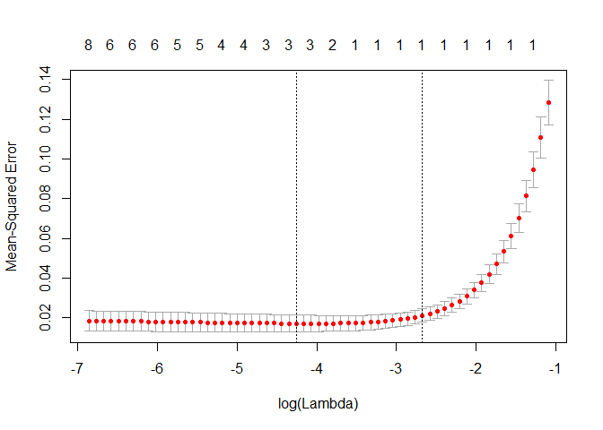

STAT576
================
Hwayoung Jung
November 18, 2018

1.  Purpose The purpose of this post is to show 1) how to examine factors associated with egg weight of a bird species, the Vinous-throated parrotbill. 2) how to compare two methods in prediction accuracy. There are several factors that might contribute to the egg size of the bird shown below with the name of the variables in the dataset.

<!-- -->

1.  Variable describtion

-   Parent\_age\_class: Age of parents that lay eggs. Measuring age in wild bird precisely is not easy, so I measured in categorical way. They are either young, which means it is their 1st year of laying eggs, or old, which means when they are older than 1year when they lay eggs.
-   Tarsus: length of legs in (mm), continuous variable
-   Bill: length of bill (mm), continuous variable
-   Wing: length of wing span (mm), continuous variable
-   Tail: Length of tail feather (mm), continuous variable
-   Temperature: averaged temperature of 4 days before the date of laying eggs
-   ld: Date of egg laying. 0 means the first date of egg laying and the other number means the number of days passed from the first date of egg laying (0). Continuous variable.
-   cs: Clutch size, which means the number of eggs in a nest. On average, the birds lay 5 eggs but sometimes lay 4 or 6 eggs. There are only three values in this measurement, 4,5 and 6, so it is close to categorical variable.
-   weight: Averaged weight of the eggs in a nest. (g). continuous variable Among the variables, weight is the dependent variables and all other variables are independent variables.

1.  Types of analysis First, let's look at the data.

``` r
dat=read.csv("vp.csv",header=T,row.names=1)
head(dat)
```

    ##     parent_age_class Tarsus Bill Wing Tail length ld cs   weight
    ## 105              old   19.8  8.2 52.9 68.9 10.100  0  5 1.168073
    ## 154              old   19.9  8.3 53.0 69.0 11.200  0  6 1.233772
    ## 223              old   19.8  8.4 52.9 69.1 13.900  0  6 1.288073
    ## 198            young   20.0  8.4 53.1 69.1 11.900  1  6 1.313408
    ## 92             young   19.8  8.1 52.9 80.9 11.775  6  5 1.393408
    ## 93             young   18.5  7.3 50.4 61.9 12.600  6  5 1.410950

``` r
plot(dat)
```

 As you see, variables are highly correlated.

The typical analysis that most first-year graduate students in Business analytics department or graduate students in other fields would be multiple regression. However, there are problems of using multiple regression in this data, because of multicollinearity. For example, 4 measurements in body size (Tarsus, Bill, wing and tail) will be all correlated. Also, laying date will be correlated with temperature because the data has been collected through early March to August. As the laying date increases, temperatures will also be increased as moving from spring to summer. To deal with this colliniearity, I used shrinkage methods that effectively reduce coefficient estimates towards zero, the ridge regression and the lasso regression.

1.  Overview of analysis techniques Both ridge and lasso regression have a tuning parameter called lambda, which is a critical penalty term to reduce coefficients. The role of lambda is to adjust value of coefficient estimates and results of both regression methods subject to change according to the lambda. Hence it is crucial to set an appropriate lambda to get the best results.

Ridge regression is an improved version of ordinary least square analysis. When lambda equals to 0, it is exactly the same analysis with ordinary least square. As the lambda increases, the shrinkage penalty increases, and coefficient estimates get closer to zero. One thing to note is that, even though the coefficients reduces toward zero, these do not reach to actual zero. That means all independent variables will be included no matter how high the lambda is.

Lasso regression works also similarly with ordinary least square analysis. The main difference with ridge regression is that it use l2 norm and lasso regression is based on l1 norm. l2 norm means the squared value and l1 norm means the absolute value that without being squared.

1.  Pros and cons of each method If all variables contribute to the prediction of dependent variable, then ridge regression works better, whereas if only some variables contribute, then lasso regression is appropriate. Benefit of ridge regression:

-   When the variance is high, it can reduce it effectively. Disadvantage of ridge regression:
-   Ridge regression does not shrink coefficient to zero, so it does not have variable selection property that lasso regression has. Benefit of lasso:
-   Since the number of independent variables is decreased, we can get more parsimonious results and easy to interpret. Limitation of lasso:
-   Subject to produce biased results
-   It lacks consistency to produce same results
-   If variables are highly correlated, it will make one of the coefficient of variable 0, which in turn can result in losing information.

1.  Now let's perform ridge regression first.

``` r
library(glmnet)
```

    ## Warning: package 'glmnet' was built under R version 3.4.4

    ## Loading required package: Matrix

    ## Loading required package: foreach

    ## Warning: package 'foreach' was built under R version 3.4.4

    ## Loaded glmnet 2.0-16

``` r
x=model.matrix(weight~.,dat)[,-1] #removing the first column that only has intercept (we don't need it)
y=dat$weight
```

First, we will split dataset into training and test data. Half of the data is training and the remaining half is test data. The reason of splitting training and testing part is to ensure the trained model can be generalized to unknown dataset (test data).

``` r
train = sample(1:nrow(x), nrow(x)/2)
test = (-train)
```

As explained above, prediction accuracy is depend on the lambda. To choose the best lambda, we will perform cross validation by using cv.glmnet function. We will store the best lambda into r.min

``` r
cvfitr=cv.glmnet(x[train,],y[train],alpha=0)
plot(cvfitr)
```


``` r
r.min=cvfitr$lambda.min #this is the best lambda
```

fitting the Ridge regression with the best lambda
=================================================

``` r
predicted_tr=predict(cvfitr,newx=x[train,],s=r.min)
predicted_ts=predict(cvfitr,newx=x[test,],s=r.min)
```

comparing MSE between train and test dataset to examine overfitting
===================================================================

``` r
train_mse=mean((y[train]-predicted_tr)^2)
test_mse=mean((y[test]-predicted_ts)^2)
```

1.  Now let's perform lasso regression. Since we already divided the data with training and test set, we will start from cross validation to choose the best lambda.

``` r
#cross validation for lambda to choose the best lambda. For lasso regression, we choose alpha as 1.
cvfitl=cv.glmnet(x[train,],y[train],alpha=1)
plot(cvfitl)
```



``` r
l.min=cvfitl$lambda.min #this is the best lambda
```

fitting the Ridge regression with the best lambda
=================================================

``` r
predicted_tr=predict(cvfitl,newx=x[train,],s=l.min)
predicted_ts=predict(cvfitl,newx=x[test,],s=l.min)
```

comparing MSE between train and test dataset to examine overfitting
===================================================================

``` r
train_mse=mean((y[train]-predicted_tr)^2)
test_mse=mean((y[test]-predicted_ts)^2)
```
